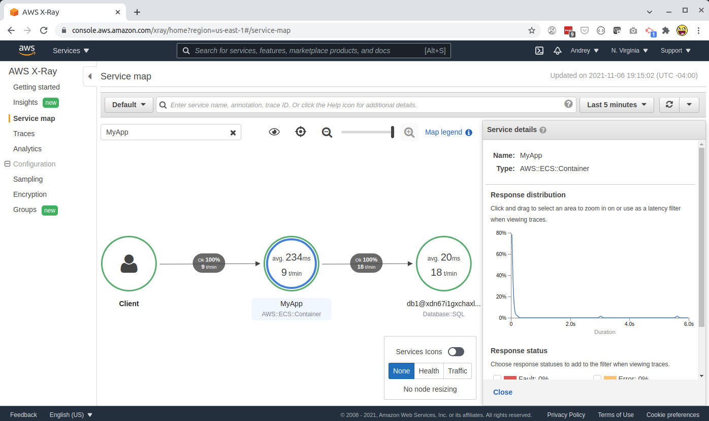
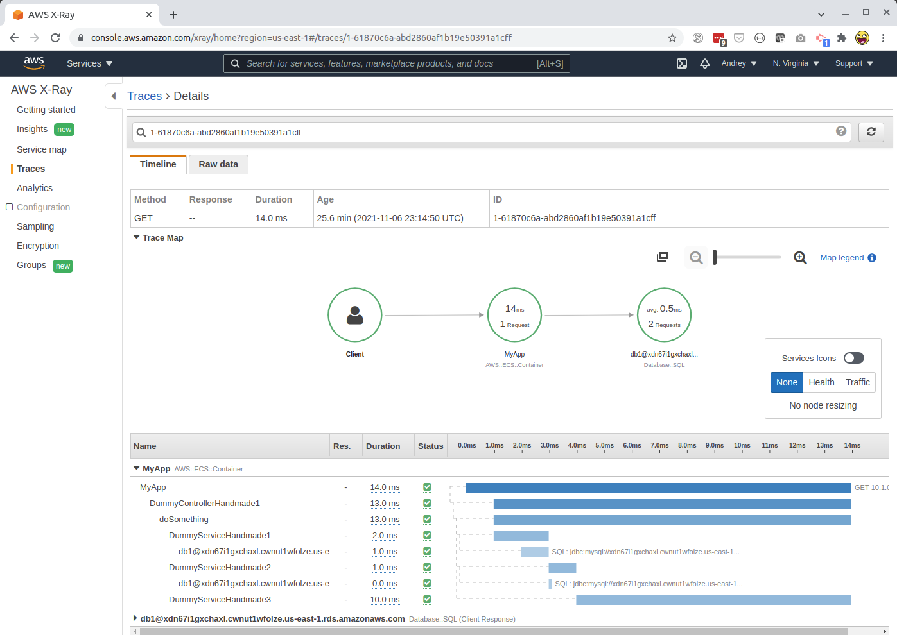

# xray-experiment

An AWS X-Ray hello world. The goal is to see what details X-Ray can collect from a Java/Spring app without adding too much custom code.

* `./tool.sh deploy-shared` and `./tool.sh undeploy-shared` to deploy and undeploy the shared stack.
* `./tool.sh deploy-app` and `./tool.sh undeploy-app` to deploy and undeploy the app stack. Make sure to `./gradlew clean bootJar` before it.

## How to run

* Build the app and deploy the stacks.
* Look up the `Url` in the `xrap-app` stack outputs.
* Either go to that URL, or run `ab -n 1000 -c <Url>` to produce a few test requests.
* Go to AWS X-Ray "Service map". You should see something like:
  
* Go to AWS X-Ray "Traces" and select one of the recent traces. You should see something like:
  
  
## Notes

* There Java-AWS integration consists of 2 parts: a Java agent and a side-car container.
* `com.amazonaws:aws-xray-recorder-sdk-core` (a dependency of `com.amazonaws:aws-xray-recorder-sdk-spring`) is primarily about the `AWSXRay.beginSubsegment()`/`AWSXRay.endSubsegment()` APIs. You can use these manually to report any segments you want.
* `com.amazonaws:aws-xray-recorder-sdk-spring` is some small amount of Spring AOP code to call `beginSubsegment()`/`endSubsegment()` automatically.
